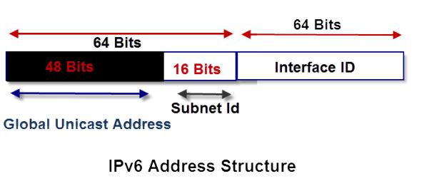
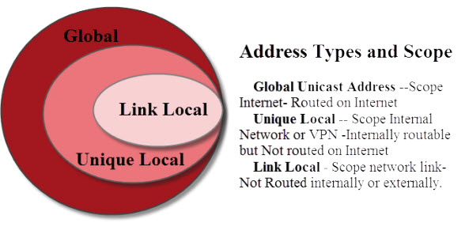

IPV6 details
============

## Address deconstruction

As in IPv4 addresses, IPv6 addresses are splitted into two components: a network component and a node component.

This was done initially using Address Classes and later using Subnet Masking.

The IPv6 address is split into two 64 bits segments, the top 64 bits is the network part and the lower 64 bits the node part

The upper 64 bits are used for routing.

The lower 64 bits identify the address of the interface or node, and is derived from the actual physical or MAC address using IEEE’s Extended Unique Identifier (EUI-64) format. See this Wiki description for exact details.

If we look at the upper 64 bits in more detail we can see that it is split into 2 blocks of 48 and 16 bits respectively the lower 16 bits are used for subnets on an internal networks, and are controlled by a network administrator.

The upper 48 bits are used for the global network addresses and are for routing over the internet.



## Address Types and Scope

IPv6 addresses have three types:
* **Global Unicast Address** - Scope Internet - routed on Internet
* **Unique Local** - Scope Internal Network or VPN internally routable, but **Not routed** on Internet
* **Link Local** - Scope network link - **Not Routed** internally or externally



## Global and Public Addresses

Global addressed are routable on the internet and start with 2001:

These addresses are known as **global Unicast addresses** and are the equivalent of the public addresses of IPv4 networks

The Internet authorities allocate address blocks to ISPs who in turn allocate them to their customers.

## Internal Addresses - Link Local and Unique Local

In IPv4 internal addresses use the reserved number ranges 10.0.0.0/8,172.16.0.0/12,192.168.0.0/16 and 169.254.0.0/16

These addresses are **not routed** on the Internet and are reserved for internal networks.

IPv6 also has **two internal address types**

* Link Local
* Unique Local

### Link Local

These are meant to be used inside an internal network, and again they are **not routed** on the Internet.

It is equivalent to the IPv4 address 169.254.0.0/16 which is allocated on an IPv4 network when no DHCP server is found

Link local addresses start with **fe80**

They are restricted to a link and are **not routed** on the Internal network or the Internet

**Link Local Addresses** are **self assigned** i.e. they do not require a DHCP server

A link local address is required on every IPv6 interface even if no routing is present

### Unique Local

**Unique Local** are meant to be used inside an internal network. They are **routed** on the Internal network but **not routed** on the Internet.

Their IPv4 addresses equivalent are 10.0.0.0/8,172.16.0.0/12 and 192.168.0.0/16

Unique local addresses start with **fc00**

## IPv6 Loopback

The IPv6 loopback address is ::1, you can ping it as follows :
``` shell
~> ping ::1 -6
```

## Recommended Video

[IPv6 Addressing and Subnetting](https://youtu.be/dUmhZOnz_qc)  

## Links

Article rewritten and simplified by myself from:  
[Steve's internet IPv6's guide](http://www.steves-internet-guide.com/ipv6-guide/)  
Check it out for more info, links and details.

For a more detailed article on IPv6 subnetting mechanisms:  
[IBM's IPv6 subnetting article](https://www.ibm.com/support/knowledgecenter/en/STCMML8/com.ibm.storage.ts3500.doc/opg_3584_IPv4_IPv6_prefix_subnet_mask.html)  

About the zone ID:  
https://superuser.com/questions/99746/why-is-there-a-percent-sign-in-the-ipv6-address  
https://howdoesinternetwork.com/2013/ipv6-zone-id  
https://networkengineering.stackexchange.com/questions/46653/what-is-the-use-of-the-ipv6-scope-id  

### Wikipedia :

About Link-Local Addresses:  
https://en.wikipedia.org/wiki/Link-local_address  

IPv6 page:  
https://en.wikipedia.org/wiki/IPv6_address  
